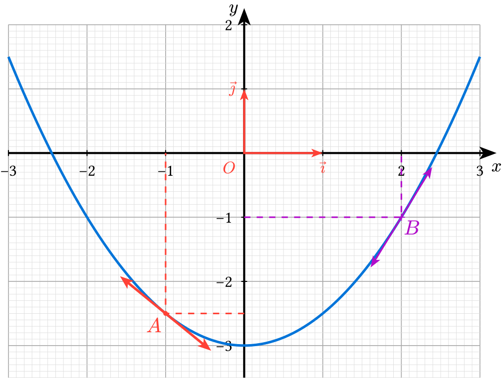

# ctz-plot-helper

A Typst helper that simplifies drawing mathematical plots with [CeTZ](https://cetz-package.github.io/) and [cetz-plot](https://cetz-package.github.io/docs/cetz-plot/), designed for high-school math lessons (French curriculum style: origin `O`, basis vectors `vec(i)`, `vec(j)`).

> **Note:** an French-commented copy of the module source is available at [`src/ctz-plot-helper-fr.typ`](src/ctz-plot-helper-fr.typ).



## Features

- **All-in-one figure builder** — `newFig(...)` computes the canvas scale factors for you, opens the canvas, applies the axis style, and runs your `plot.add(...)` / `plot.annotate(...)` calls.
- **Automatic frame `(O ; vec(i), vec(j))`** — `repere: true` (default) draws the basis vectors and hides the redundant `"1"` tick labels; with `repere: false` the origin is labeled `0` instead of the red `O`.
- **Anchored helpers drawn outside the plot** — place markers, labels, polylines and derivative arrows in *real canvas units* so they stay geometrically correct in an anisotropic frame.
- **Bulk points in one call** — `anchored-points(...)` places several markers (and optional labels) at once, with shared `marker`/`label` options.
- **Scale correction** — real slopes are converted to on-screen slopes (`anchored-derivative-arrow`), so tangents stay visually correct even when the x and y axes have different scales.
- **No single-point marker bug** — `point-marker` draws isolated points inside `plot.annotate` with the same shape vocabulary as `plot.add`, without cetz-plot's single-point bug.
- **Scatter plots in one call** — `scatter(...)` draws a marker at each point of a list, with a friendly marker vocabulary (`mark-fill`/`mark-stroke` instead of a raw `mark-style` dictionary).

## Requirements

- [Typst](https://typst.app/) ≥ 0.15.0
- [`@preview/cetz:0.5.2`](https://typst.app/universe/package/cetz)
- [`@preview/cetz-plot:0.1.4`](https://typst.app/universe/package/cetz-plot)

## Installation

> [!NOTE]
> **Not yet published on the Typst Universe (`@preview`).** The `@preview` import below will only work once the package is published. Until then, install the package locally and use the `@local` import. The module will be published to `@preview` depending on user feedback.

```typ
#import "@preview/ctz-plot-helper:0.1.0"
```

If the package is installed locally:

```typ
#import "@local/ctz-plot-helper:0.1.0"
```

## Quick start

```typst
#import "@local/ctz-plot-helper:0.1.0": *

#newFig(
  size: (8, 6),
  x-min: -3.0,
  x-max: 3.0,
  y-min: -3.5,
  y-max: 2.0,
  {
    plot.add(domain: (-3, 3), x => .5 * x * x - 3, style: (stroke: blue + 1.2pt), samples: 100)
  },
  extra: (sx, sy) => {
    let x1 = -1
    let x2 = 2
    let y(x) = .5 * x * x - 3
    let yp(x) = x

    anchored-lines((0, y(x1)), (x1, y(x1)), (x1, 0), stroke: (thickness: 0.75pt, dash: "dashed", paint: red))
    anchored-point(
      (x1, y(x1)),
      marker: (marker-fill: red, marker-size: 0.04),
      label: (
        label-text: text(size: 0.9em, fill: red, $A$),
        label-position: -135deg,
      ),
    )
    anchored-derivative-arrow((x1, y(x1)), yp(x1), length: 2, fill: red, stroke: red + 1.2pt)

    anchored-lines((0, y(x2)), (x2, y(x2)), (x2, 0), stroke: (thickness: 0.75pt, dash: "dashed", paint: purple))
    anchored-point(
      (x2, y(x2)),
      marker: (marker-symbol: "+", marker-stroke: purple + .5pt),
      label: (
        label-text: text(size: 0.9em, fill: purple, $B$),
        label-distance: 7pt,
        label-position: -45deg,
      ),
    )
    anchored-derivative-arrow((x2, y(x2)), yp(x2), length: 2, fill: purple, stroke: purple + 0.8pt)
  },
)
```

## API reference

### `newFig`

All-in-one figure builder. Computes `sx`, `sy` automatically, opens the canvas, applies the axis style, calls `monplot(...)` with merged `setPlot(...)` options, and draws optional content outside the plot but inside the canvas.

| Parameter | Type | Default | Description |
| --- | --- | --- | --- |
| `size` | `array` | `(12.0, 6.5)` | Physical dimensions of the plot (width, height), in cm |
| `x-min`, `x-max` | `float` \| `int` | `-3.0`, `3.0` | Bounds of the x domain |
| `y-min`, `y-max` | `float` \| `int` | `-3.5`, `3.0` | Bounds of the y domain |
| `axes` | `dictionary` | `setAxes()` | Axis style, see `setAxes()` |
| `extraStyles` | `dictionary` | `setExtraStyles()` | Styles of the basis arrows (i, j), see `setExtraStyles()` |
| `repere` | `bool` | `true` | Shows/hides `(O ; vec(i), vec(j))` and the `"1"` graduation; if `false`, the origin is labeled `"0"` instead of `O` (no red) |
| `plot` | `dictionary` | `(:)` | Override of the `setPlot()` options (e.g. `(x-tick-step: 0.5)`) |
| `extra` | `function` \| `none` | `none` | `(sx, sy) => content`, drawn after the plot, inside the canvas |
| `body` | `content` | — | Content placed INSIDE `plot.plot` (`plot.add`, `plot.add-anchor`, `plot.annotate`...) |

### `setPlot`

Default options of `plot.plot(...)` as a dictionary. `newFig` injects its own `size` / domains / formats; any extra parameter (e.g. `y-equal:`) passes through `..more` to `plot.plot`.

| Parameter | Type | Default | Description |
| --- | --- | --- | --- |
| `size` | `array` | `(12, 6.5)` | Physical size of the plot (width, height), in cm |
| `x-min`, `x-max` | `float` \| `int` | `-3`, `3` | Bounds of the x domain |
| `y-min`, `y-max` | `float` \| `int` | `-3.5`, `3` | Bounds of the y domain |
| `name` | `string` | `"plot"` | Name of the plot (for `"plot.<name>"` in `plot.add-anchor`) |
| `x-tick-step` | `float` \| `int` | `1` | Step between two major graduations on x |
| `x-minor-tick-step` | `float` \| `int` | `0.1` | Step between two minor graduations on x |
| `y-tick-step` | `float` \| `int` | `1` | Step between two major graduations on y |
| `y-minor-tick-step` | `float` \| `int` | `0.1` | Step between two minor graduations on y |
| `axis-style` | `string` | `"school-book"` | Axis style |
| `x-format` | `function` | hides `1` | Formatting of the values on the x-axis |
| `y-format` | `function` | hides `1` | Formatting of the values on the y-axis |
| `x-label` | `content` | `$x$` | Label of the x-axis |
| `y-label` | `content` | `$y$` | Label of the y-axis |
| `x-grid` | `string` \| `none` | `"both"` | Vertical grid (`"major"`, `"minor"`, `"both"` or `none`) |
| `y-grid` | `string` \| `none` | `"both"` | Horizontal grid (`"major"`, `"minor"`, `"both"` or `none`) |
| `..more` | `any` | — | Extra parameters forwarded as is to `plot.plot` |

### `setAxes`

Axis style dictionary, to pass to `set-style(axes: ...)` (via `newFig(axes: ...)`).

| Parameter | Type | Default | Description |
| --- | --- | --- | --- |
| `grid` | `stroke` | `gray + 0.4pt` | Main grid style |
| `minor-grid` | `stroke` | `gray.lighten(60%) + 0.2pt` | Minor grid style |
| `shared-zero` | `content` | `text(size: 8pt, fill: red)[$O$]` | Label at the common origin |
| `padding` | `length` | `0pt` | Offset beyond the axes |
| `overshoot` | `length` | `8pt` | Overshoot of the axis arrowheads |
| `tick-stroke` | `stroke` | `black + 0.5pt` | Major tick style |
| `tick-length` | `float` \| `int` | `0.1` | Major tick length |
| `tick-minor-stroke` | `stroke` | `gray + 0.3pt` | Minor tick style |
| `tick-minor-length` | `float` \| `int` | `0` | Minor tick length |

`mesaxes` is an alias kept for backward compatibility.

### `setExtraStyles`

Extra styles (axis arrowheads) to merge with those of `setAxes()`.

| Parameter | Type | Default | Description |
| --- | --- | --- | --- |
| `x` | `dictionary` | `(mark: (end: "stealth", fill: black))` | Style of the x-axis arrowhead |
| `y` | `dictionary` | `(mark: (end: "stealth", fill: black))` | Style of the y-axis arrowhead |

### `monplot`

Wraps `plot.plot(...)`. Takes a ready-made options dictionary (typically from `setPlot(...)`) and the body that goes inside the plot. Automatically adds `plot.add-anchor("O", (0, 0))`, so the `"plot.O"` anchor is always available.

| Parameter | Type | Description |
| --- | --- | --- |
| `options` | `dictionary` | Options of `plot.plot`, typically produced by `setPlot(...)` |
| `body` | `content` | Content placed in `plot.plot` |

### `anchored-basis-vectors`

Draws the two basis vectors of `(O ; vec(i), vec(j))`, with a length of `length` **data units** (default `1` = unit vector). Shaft and arrowhead are drawn directly in the canvas frame — no distortion from frame anisotropy. The two segments form **one continuous polyline** `(i) -- (O) -- (j)`. Call it **outside** `plot.plot(...)`; it retrieves `sx`, `sy` automatically.

| Parameter | Type | Default | Description |
| --- | --- | --- | --- |
| `origine` | `string` \| `array` | `"plot.O"` | Anchor `"plot.<name>"`, or `(x, y)` in data units |
| `x-length` | `float` \| `int` | `1` | Length of `vec(i)`, in data units |
| `y-length` | `float` \| `int` | `1` | Length of `vec(j)`, in data units |
| `fill` | `color` | `red` | Color of the arrows and labels |
| `stroke` | `auto` \| `stroke` | `auto` | Stroke (`auto` = `fill + 1pt`) |
| `mark-scale` | `float` \| `int` | `.5` | Arrowhead size |

### `anchored-point`

Optional marker and/or label at a plot anchor OR at `(x, y)` coordinates in data units. Call it **outside** `plot.plot(...)`; it retrieves `sx`, `sy` automatically. Each item is independent: if `marker` or `label` is `none`, it is not drawn (both `none` → nothing at all).

```typst
anchored-point(
  (1, 1),
  marker: (marker-fill: red),
  label: (label-text: "A", label-position: 90deg),
)
```

| Parameter | Type | Default | Description |
| --- | --- | --- | --- |
| `origine` | `string` \| `array` | — | Anchor `"plot.<name>"`, or `(x, y)` in data units |
| `marker` | `dictionary` \| `none` | `(marker-symbol: "o", marker-size: 0.06, marker-fill: red, marker-stroke: none, marker-angle: 0deg)` | `(marker-symbol, marker-size, marker-fill, marker-stroke, marker-angle)` — see `draw-mark-shape`; `none` = no point |
| `label` | `dictionary` \| `none` | `(label-text: "", label-distance: 8pt, label-anchor: "center", label-position: 0deg, label-rotate: 0deg, label-styles: (:))` | `(label-text, label-distance, label-anchor, label-position, label-rotate, label-styles)`; `none` = no label |

### `anchored-points`

Places several points (and, optionally, their labels) in one call. Each item is a pair `(origine, label-text)` — same `origine` vocabulary as `anchored-point`, and `label-text` is either the text/content for that point's label, or `none` to skip the label for that point. The `marker:`/`label:` options are shared by every point; `label: none` (or `marker: none`) turns labels (or markers) off for **all** points at once.

```typst
anchored-points(
  ((1, 1), "A"),
  ((2, 4), "B"),
  ((3, 2), none), // marker only, no label for this point
  marker: (marker-fill: red),
  label: (label-position: 90deg, label-distance: 6pt, label-styles: (fill: blue, size: 0.8em)),
)
```

| Parameter | Type | Default | Description |
| --- | --- | --- | --- |
| `..points` | `array` | — | Pairs `(origine, label-text)`, one per point — `label-text` may be `none` |
| `marker` | `dictionary` \| `none` | `(marker-symbol: "o", marker-size: 0.06, marker-fill: red, marker-stroke: none, marker-angle: 0deg)` | Shared marker options, see `anchored-point`; `none` = no markers at all |
| `label` | `dictionary` \| `none` | `(label-text: "", label-distance: 8pt, label-anchor: "center", label-position: 0deg, label-rotate: 0deg, label-styles: (:))` | Shared label options (`label-text` overridden per point), see `anchored-point`; `none` = no labels at all |

### `anchored-lines`

Draws a polyline between several points of the frame — each point is a `"plot.<name>"` anchor or `(x, y)` coordinates in data units. Points are converted to canvas coordinates **before** being connected, so the stroke stays straight on screen even in an anisotropic frame. Call it **outside** `plot.plot(...)`.

| Parameter | Type | Default | Description |
| --- | --- | --- | --- |
| `..points` | `string` \| `array` | — | `"plot.<name>"` anchors and/or `(x, y)` coordinates, at least two |
| `stroke` | `stroke` | `black + 1pt` | Line stroke |
| `mark` | `none` \| `dictionary` | `none` | Arrowheads at the ends (see `line(mark:)`) |

### `anchored-derivative-arrow`

Derivative arrow with a **fixed** size (cm), with the slope corrected to stay geometrically consistent in an anisotropic frame. Call it **outside** `plot.plot(...)`.

```typst
anchored-derivative-arrow((1, 1), 2, fill: red, stroke: red + 1.2pt)
```

| Parameter | Type | Default | Description |
| --- | --- | --- | --- |
| `origine` | `string` \| `array` | — | Anchor `"plot.<name>"`, or `(x, y)` in data units |
| `slope` | `float` \| `int` | — | Real slope in data units (e.g. `spline-dy(...)`) |
| `fill` | `color` | `black` | Arrow color |
| `length` | `float` \| `int` | `1` | Fixed length of the arrow, in cm |
| `stroke` | `stroke` | `1pt` | Stroke thickness/color |
| `mark-scale` | `float` \| `int` | `.6` | Arrowhead size |

### `point-marker`

Marks a single point `(x, y)` **in data units** — to be used **inside** `plot.annotate`. Same shape vocabulary as `plot.add(mark:)`, but without its single-point bug.

| Parameter | Type | Default | Description |
| --- | --- | --- | --- |
| `x`, `y` | `float` \| `int` | — | Coordinates of the point, in data units |
| `symbol` | `string` | `"o"` | `"o"`, `"x"`, `"+"`, `"square"`, `"triangle"`, `"diamond"` |
| `size` | `float` \| `int` | `0.06` | Half-size of the symbol, in data units |
| `fill` | `color` | `red` | Fill color or stroke color |
| `stroke` | `none` \| `stroke` \| `color` | `none` | Outline (`none` = no outline, just fill) |
| `angle` | `angle` | `0deg` | Symbol orientation |

### `scatter`

Scatter plot: draws a marker at each point of `points`. To be used like `plot.add(...)`, **inside** `plot.plot(...)` — i.e. directly inside `newFig`'s `body`. Coordinates stay in data units; cetz-plot handles the scaling. Thin wrapper around `plot.add(...)` with a friendlier marker vocabulary (`mark-fill`/`mark-stroke` instead of a raw `mark-style` dictionary).

```typst
#newFig(
  size: (8, 6),
  x-min: 0,
  x-max: 7.5,
  y-min: 0,
  y-max: 5.5,
  repere: false,
  {
    scatter(
      ((1, 4.8), (2, 3.8), (4, 3), (6, 1.7), (7, 1.3)),
      mark: "x",
      mark-stroke: 1.2pt + blue,
      mark-size: 0.2,
    )
  },
)
```

| Parameter | Type | Default | Description |
| --- | --- | --- | --- |
| `points` | `array` | — | List of `(x, y)` point tuples, in data units |
| `mark` | `string` | `"o"` | Marker shape (`"o"`, `"x"`, `"+"`, `"square"`, `"triangle"`, `"diamond"`...) |
| `mark-fill` | `color` | `black` | Marker fill color |
| `mark-stroke` | `none` \| `stroke` \| `color` | `1pt + black` | Marker outline (`none` = no outline) |
| `mark-size` | `float` \| `int` | `0.1` | Marker size, forwarded to `plot.add(mark-size:)` |

### `draw-mark-shape`

Draws the "mark" of a point at a position **already in canvas coordinates** (x, y in cm). Shared by `point-marker` and `anchored-point`; do not call directly in normal use.

| Parameter | Type | Default | Description |
| --- | --- | --- | --- |
| `x`, `y` | `float` \| `int` | — | Coordinates of the point, in canvas units |
| `symbol` | `string` | `"o"` | `"o"`, `"x"`, `"+"`, `"square"`, `"triangle"`, `"diamond"` |
| `size` | `float` \| `int` | `0.06` | Half-size of the symbol, in the same unit as x, y |
| `fill` | `color` | `red` | Fill color (closed shapes) or stroke color (`"+"`/`"x"`) |
| `stroke` | `none` \| `stroke` \| `color` | `none` | Outline of closed shapes |
| `angle` | `angle` | `0deg` | Orientation (relevant for `"square"`, `"triangle"`, `"diamond"`, `"+"`, `"x"`) |

### `plot-scale`

Scale factors (canvas units per data unit) of a plot whose physical size and fixed domain are known. Used to convert a real slope into a visual on-screen slope.

| Parameter | Type | Description |
| --- | --- | --- |
| `size` | `array` | Physical size of the plot (width, height), in cm |
| `x-domain` | `array` | Domain `(x-min, x-max)` of the x-axis |
| `y-domain` | `array` | Domain `(y-min, y-max)` of the y-axis |

### `rotate-point`

Rotates the point `(x, y)` by `angle` around the center `(cx, cy)`.

| Parameter | Type | Description |
| --- | --- | --- |
| `cx`, `cy` | `float` \| `int` | Coordinates of the rotation center |
| `x`, `y` | `float` \| `int` | Coordinates of the point to rotate |
| `angle` | `angle` | Rotation angle |

### `resolve-origine`

Internal helper. Resolves `origine` to a canvas position (cm): either an existing anchor `"plot.<name>"`, or `(x, y)` in data units from `"plot.O"`. Not meant to be called directly.

## Troubleshooting

- **`newFig` + custom `x-format`/`y-format`**: an `x-format`/`y-format` given in `plot:` takes precedence over the one controlled by `repere:`, but do **not** set both at once for the same key — Typst rejects a duplicate named argument.
- **A partial `marker`/`label` dict replaces the whole default**: a partial dictionary passed to `anchored-point` overrides the defaults — provide only the keys you want to change.
- **Tidy-style doc comments**: this package uses the new tidy comment format (`///` above each parameter + `/// -> type`). Never put a trailing `//` comment after a documented parameter.

## License

This project is licensed under the [MIT License](LICENSE).

**Authors:** Mikaël MAUNIER, DeepSeek, Claude.

## Changelog

The detailed history is in [`CHANGELOG.md`](CHANGELOG.md).

### 0.1.1

- **Added** `anchored-points(...)` to place several points (and optional labels) in one call.
- **Added** `label-rotate` (and `label-styles`) options for `anchored-point` labels.
- **Renamed** `anchored-point-marker` → `anchored-point`; the old simple-circle `anchored-point` was removed.
- **Added** `scatter(...)` for one-call scatter plots.
- **Changed** `repere: false` now labels the origin `0` instead of the red `O`.

### 0.1.0

- **Initial release.**
